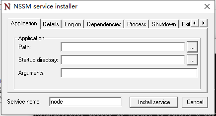

## nssm官网及下载

[nssm](https://nssm.cc/download)

## 为什么要使用nssm

    避免node服务在Windows平台下运行时间过长而挂掉

## nssm使用

1. 根据自己的操作系统位数进入`win32`文件夹或者`win64`文件夹，`win32`系统代表你的位数的是32位系统，`win64`代表你的系统位数是64位系统。现在基本新电脑都是64位系统，不知道的自行百度查看操作系统位数。
   
2. 此举例进入`win64`文件夹，在路径栏输入`cmd`后回车。
   
3. 上述步骤操作后，在命令行输入`nssm install myserver`后会弹出一个窗口，如下图：
   
   
   介绍：
      - `Application Path`：node安装路径，需要精确到node.exe，如：`C:\Program Files\nodejs\node.exe`。
      - `Startup directory`：启动路径，就像你平时输入的`node app.js`这种，这里需要精确到js文件。如：`D:\project\text\app.js`，默认是`index.js`就不用精确到js文件，但是如果是`app.js`需要自己补全。
      - 上面完事后点击`install service`，会提示你安装成功。
4. 然后在命令行再输入：`nssm start myserver`，会提示你启动成功，更多基本命令见下。

## 基本命令
- `nssm install servername`——创建servername服务，弹出配置界面
- `nssm start servername`——启动servername服务
- `nssm stop servername`——暂停servername服务
- `nssm restart servername`——重新启动服务
- `nssm remove servername` //删除创建的servername服务
- `nssm edit servername`——更改servername服务，弹出修改界面
- `nssm set servername 参数名 参数值`——设置服务参数值

## 建议

建议使用pm2管理node进程。[pm2](pm2.md)
