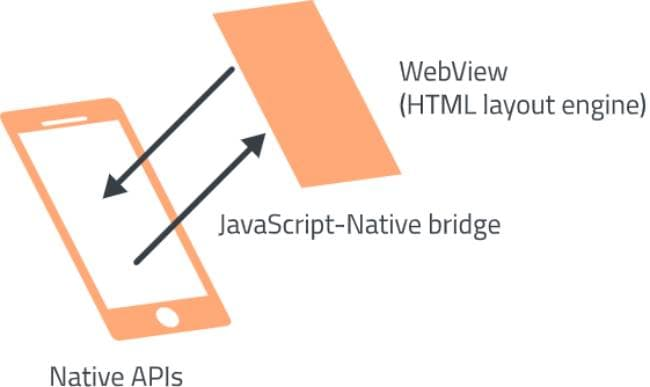

## 原生应用、Web应用、混合应用

表面上看，手机App都是同样东西，就是手机上的应用程序，点击图标就能运行，但是他们的底层技术不一样。按照开发技术，App可以分为三大类：

:::info
- 原生应用（native application，简称：native App）
- Web应用（web application，简称：web App）
- 混合应用（hybrid application，简称：hybrid App）
:::

这三种类型的App的技术模型都不一样，各有优缺点。

## 原生应用

**概念**

原生App是专门为特定手机平台开发的应用程序，无法在其它平台运行。一个手机软件如果要同时支持苹果手机和安卓手机，就需要为他们各写一个原生App。

原生App使用与手机操作系统相同的语言。ios的原生App使用Objective-C语言或swift语言，安卓使用Java语言或Kotlin语言。由于跟底层语言的语言和技术模型一致，所以原生App的性能和用户体验都很好。

**优点**
原生App的优点主要是两个：
1. 较好的性能和体验
2. 可以使用系统的所有硬件和软件API，比如GPS、摄像头、麦克风、加速计、通知推送等待，能充分发挥系统的潜力。

**缺点**
1. 原生App的缺点主要是成本，每个平台都要建立一个独立的开发团队，大公司一般都有ios和Android两个开发团队，现在还有了鸿蒙，相当于要组建三个团队，各自开发不同操作系统类型的App，成本非常高。
2. 原生app使用的底层操作系统的语言，都是很重编辑型语言，开发和调试成本相对较高，时间周期长。
3. 第三个缺点是，原生app必须下载安装才能使用，只要升级版本，就必须重新下载安装。用户往往不愿意更新版本，厂商被迫不得不长期支持很久以前的旧版本。
   
## web应用
**概念**

web app是使用网页做的应用程序，必须在浏览器中使用。比如你在浏览器中收发邮件，就是在使用web app。

web app主要使用网页技术，即html、JavaScript和css。W3C组织发布了HTML第五版，简称HTML5，该版本大大增强了网页的功能，使得网页可以当作应用程序使用，而不仅仅是展示文字和图片，这就是web app的由来。

**优点和缺点**

优点：
1. 无需下载安装，打开浏览器就能使用，而且总是使用最新的版本
2. 对于开发者来说，web app写起来比较快，调试容易，不需要应用商店的批准就能发布。

缺点：
1. 浏览器提供的api即（web api）很有限（目前只有相机、GPS、电池等少数几个），大部分系统硬件都不能通过网页访问，也无法直接读取硬盘文件，所以web app无法充分利用平台的硬件。
2. 网页通过浏览器渲染，性能不如原生app，不适合做性能要求较高的页面。

**web app劣势**
1. web app需要打开浏览器才能使用，平台依赖性强。
2. 用户必须记住如何导航它，要么输入网址，要么历史记录，要么浏览器书签，使得不如原生app方便。

## PWA
为了推广web app，谷歌公司的chrome浏览器团队做了很多的努力。他们认为，web app足以大多数app的需求，但是三大缺陷它的推广。
1. 不能从手机的首屏直接进入。
2. 缺乏手机状态栏和锁屏时的通知推送能力。
3. 不支持脱机访问（即断网就不能使用了）

为了解决这些问题，chrome团队开发了新技术“渐进式web app”（Progressive web app，缩写pwa）。它可以把网站缓存在手机里面，供离线时使用，还能在手机首屏生成图标，直接点击进入，并且有通知推送能力，也不带有浏览器的地址和状态栏，跟原生App的使用体验非常接近。

但是，PWA需要浏览器访问一次网站，才能在首屏生成图标，并且目前IOS系统的支持还不够理想，所以还只是一项探索性质的技术，迄今为止缺乏足够的成功案例。

## 混合应用

**概念**

混合app（hybrid app）顾明思义就是原生app与web app的结合。它的壳是原生app，但是里面放的是网页。可以理解成，混合app里面隐藏了一个浏览器，用户看到的实际上是这个隐藏浏览器渲染出来的网页。  
  
混合app的原生外壳称为“容器”，内部隐藏的浏览器，通常使用系统提供的网页渲染控件（即webview控件），也可以自己内置一个浏览器内核。结构上，混合app从上到下分成三层：HTML5网页层、网页引擎层（本质上是一个隔离的浏览器实例）、容器层。

## API Bridge
混合app里面的网页不同于普通网页，可以调用底层系统所有的API。奥秘就在于外层容器提供了API Bridge，充当底层API的中介，允许内部的网页调用底层。

所谓的API Bridge就是容器在底层接口的网页之间，建立一座桥梁，让双方通信。容器一旦接到网页的请求，就根据请求去调用底层系统的API，然后再返回结果给网页。API Bridge往往以JavaScript语言提供，方便网页调用，这时又称为JSBridge。

不同容器的 API Bridge 是不一样的。为某个容器写的网页，不能放在另一个容器使用，也无法在浏览器使用，除非网页脚本做了兼容处理。

容器提供的 API Bridge 必须跟着平台更新。比如，iOS 发了新版本，有了新的硬件 API，容器也必须跟着推出新版的 API Bridge。如果容器没有跟上，开发者为了使用新的硬件，就只能想办法自己来写缺失的 API Bridge。

**优点**  
混合app同时具有app和web app的优点，又可以避免它们的一些缺点。具体来说，可以总结为三点。
1. 跨平台  
   web技术是跨平台的，开发者只写一次页面，就能支持多个平台。也就是说，混合app只需要一个团队就够了，开发成本较低。
2. 灵活性  
   混合app的灵活性非常大，很容易集成很多功能。一方面，混合app很容易加载外部的H5页面，实现app的插件结构；另一方面，web页面可以方便地调用外部的web服务。
3. 开发方便
   web页面的调试和构建，原比原生控件简单省时，页面的更新也容易，只要在服务器上发布新版本，触发容器内更新就可以了。
  
**缺点**  
1. 由于存在网页引擎的中间层，所以性能比较欠缺，不仅不如原生app，而且由于webview不是全功能浏览器，可能相比webapp都要慢一些。
2. 由于页面跨平台，就无法使用只有特定平台提供的功能，导致体验不如纯的原生app。举例来说，早期的时候，安卓又物理的后退按钮，iphone没有，页面设计不得不考虑这一点。

## 小程序
所谓小程序，可以看作是针对特定容器的H5开发。微信本身是一个容器，开放自己的（JSBridge），外部开发者使用规定的语法，编写页面，容器可以动态加载页面。  
小程序对于微信官方的好处，扩展了功能和应用场景，吸引外部开发者加入，繁荣了生态。对于外部开发者的好处是，有了流量入口，可以直接调用微信的各种功能（比如支付）。

